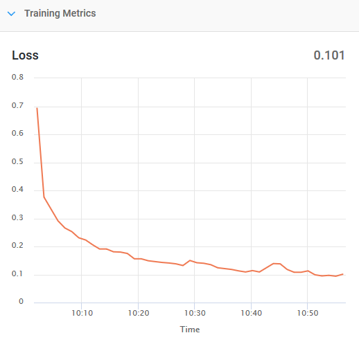
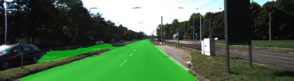
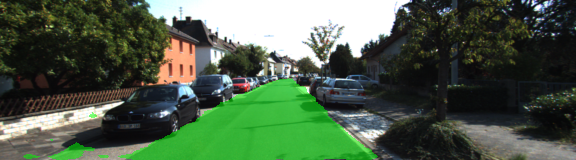
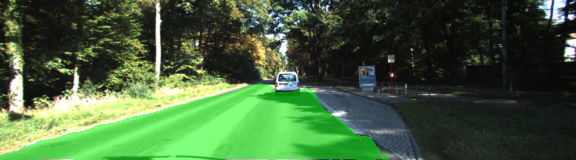
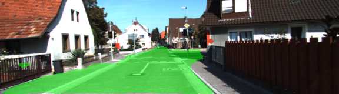
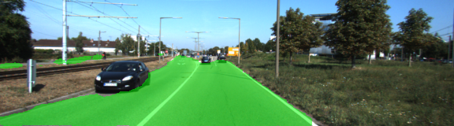
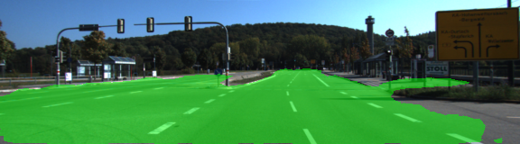
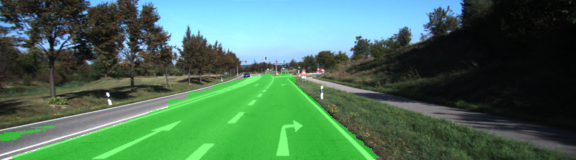
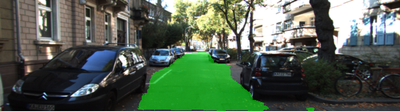

# Udacity Self-driving Car Nanodegree
# Term 3, project 2
==================================================
# Semantic Segmentation

### Introduction
In this project, I had to label the pixels of a road in images using a Fully Convolutional Network (FCN).

#### Frameworks and Packages 

 - [Python 3](https://www.python.org/)
 - [TensorFlow](https://www.tensorflow.org/)
 - [NumPy](http://www.numpy.org/)
 - [SciPy](https://www.scipy.org/)

##### Dataset
Kitti Road dataset
(http://www.cvlibs.net/datasets/kitti/eval_road.php) from [here](http://www.cvlibs.net/download.php?file=data_road.zip).  

##### Implementation
The implementation had to be written in the `main.py` module indicated by the "TODO" comments.  


### General approach

The main goal of this project is to create and train a FCN starting from an already trained model (VGG16) of a CNN.
The first step taken was to transform the CNN in a FCN using 1x1 convolutional layer instead of the dense fully connected layer in order to preserve the spatial information of the input image. This step is impelented in the functions 
```python 
load_vgg(sess, vgg_path)
``` 
and 
```python
layers(vgg_layer3_out, vgg_layer4_out, vgg_layer7_out, num_classes)
```

The first function loads the VGG16 pretrained model with its weights, the second function adds to this model the "decoding" layers (as in the FCN terminology the VGG16 model can be seen as an encoder).

The decoding layers are 1x1 convolutions and transpose convolution layers to "upsample" the image to its original size. The decoder also uses the skip method to get informations from other layers of the encoder network.

In order to avoid overfitting, I used an L2 regularization for each convolutional and transpose convolutional layer, and a dropout probability of 0.2.  

The kernel where initialized with a normal distribution.  

The number of epochs to train was determined only according to an economic evaluation (I had just 2 free hours left of GPU time to spend on Floydhub)
The batch size was set so that the training used around 60% of total GPU memory ( to avoid the "exhausted resources" error)


#### Parameters

The parameters used are the following:

* EPOCHS = 45
* BATCH SIZE = 5
* KEEP PROB = 0.8
* LEARNING RATE = 1e-3
* L2 SCALE = 1e-3
* STD DEVIATION KERNEL INITIALIZER = 1e-2

 

### Results

The final average loss on the training set was **0.101**, but it was still decreasing, so with more epochs it would have achieved something better.

	 


##### Here are some of the test images:  

   

   

   

   

   

   

   

   

   

 

